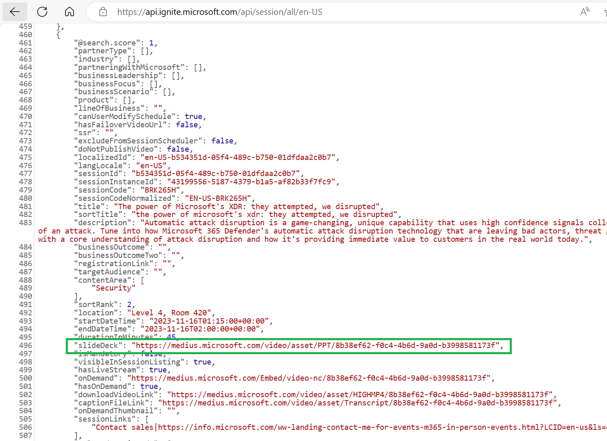

# Microsoft Flagship Event Deck Download
Simple script to download decks from flagship event [Microsoft Ignite](https://ignite.microsoft.com/en-US/home) or [Microsoft Build](https://ignite.microsoft.com/en-US/home) sessions.<br><br>

The APIs for getting session details may be a bit different for each event in different years, so old script may need to be adjusted accordingly.
<br><br>


## Script files
- [Microsoft Ignite 2023](/MSIgnite2023Nov-Download-Resources.ps1)
- [Microsoft Build 2024](/MSBuild2024-Download-Resources.ps1)


## Usage

Download all decks
```
./<event script file>.ps1
```
Download specific session decks
```
./<event script file>.ps1 -sessionCodes "BRK403,BRK404"
```

Session Deck download link can be found in key _slideDeck_

<br>

